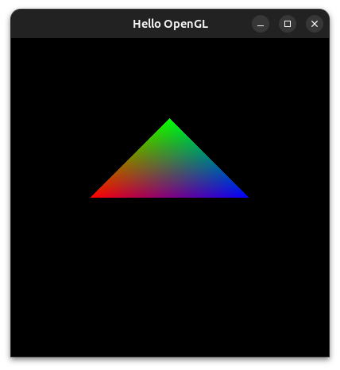

# OpenGL

## Overview
OpenGL stands for Open Graphics Library.

>_"It is a cross-language, cross-platform application programming interface 
>for rendering 2D and 3D vector graphics. The API is typically used to 
>interact with a graphics processing unit (GPU), to achieve hardware-
>accelerated rendering." - [Wikipedia](https://wikipedia.org/wiki/OpenGL)_

The OpenGL API only deals with rendering graphics. Hardware vendors, the 
GPU manufacturers are responsible for writing the implementations (drivers)
of the OpenGL rendering system. OpenGL does not provide functons for managing 
input, audio or drawing windows.

>Each graphics card supports a specific version of OpenGL and so updating your graphics 
>drivers is recommended. However, there exists software implementations of OpenGL 
>such as Mesa.

In addition to having a low-level graphics rendering API, OpenGL is event-driven 
and offers maximal portability since it is operating system-independent, 
display-device and window-system independent.

As a programmer, you can use OpenGL to write graphics programs. Your programs 
only respond to events such as mouse - clicks, keyboard - keypress, window - 
reshape and others. The operating system maintains an event queue that takes in
user-defined callback functions (event listeners) and each invoked when a certain
event is triggered.

OpenGL has a few variants such as OpenGL ES for mobile devices and WebGL - a JavaScript 
implementation of OpenGL ES 2.0

There are multiple language bindings for OpenGL for example:
- JavaScript ([WebGL](https://developer.mozilla.org/docs/Web/API/WebGL_API) 
for browser-based 3D rendering)
- C/C++
- Java, and others.

This repository aims to help you get started with OpenGL by creating a 
basic program in C++.

## Installation
The OpenGL Utility Toolkit (GLUT) library comes with the OpenGL library and
minimal window management for fast prototyping.

### Linux (Debian-based OS)

Load updates and update packages to their latest version
```sh
sudo apt update && sudo apt upgrade
```

Install OpenGL
```sh
sudo apt install freeglut3-dev
```

Verify the installation
```sh
dpkg -L freeglut3-dev
```

## Getting Started

Create a c++ file: `main.cpp` and add the GLUT header file
```cpp
#include <GL/glut.h>

// code goes here
```

Every OpenGL program must register a display callback function to render the 
objects on the screen. For now, just add its prototype
```cpp
...
void display(void);
```

In your main function, initialize GLUT with the command line arguments and create
a new window within which the graphics will be rendered. It is from the created 
window that events are triggered.
```cpp
...
int main(int argc, char* argv[])
{
    // initializes GLUT
    glutInit(&argc, argv);

    // set display mode (single buffer with RGB colors 
    // since there are no animations
    glutInitDisplayMode(GLUT_SINGLE | GLUT_RGB);

    // set window initial position
    glutInitWindowPosition(200, 300);
    
    // set window initial size
    glutInitWindowSize(400, 400);

    // create the window with a title e.g "Hello OpenGL"
    glutCreateWindow("Hello OpenGL");

    // register the display function, triggered whenever a new 
    // frame is required
    glutDisplayFunc(display);

    // start the event loop: the system will listen for events 
    // and trigger their respective callback functions
    glutMainLoop();
}
```

Here is how you can implement the `display` function to render a 2D triangle using 
OpenGL (notice that OpenGL functions begin with `gl` and not `glut`).
```cpp
...
// function that draws on the canvas (window in this case)
void display(void)
{
    // set the clear color (more like the color of the rubber)
    glClearColor(0, 0, 0, 1);
    
    // clear the display using the clear color
    glClear(GL_COLOR_BUFFER_BIT);

    // start drawing a polygon
    glBegin(GL_POLYGON);
        // set the paint color to red and draw a vertex
        glColor3f(1.0f, 0.0f, 0.0f); glVertex2f(-0.5f, 0.0f);
        // blue corner
        glColor3f(0.0f, 1.0f, 0.0f); glVertex2f(0.0f, 0.5f);
        // green corner
        glColor3f(0.0f, 0.0f, 1.0f); glVertex2f(0.5f, 0.0f);
    // finish the polygon
    glEnd();

    // send the polygon data for rendering on the window
    glFlush();
}
```

Find the source code for this demo [here](./main.cpp).

## Building

To build and run the cpp file, run the following command:
```sh
g++ main.cpp -o main -lGL -lGLU -lglut && ./main
```

The output is a new window titled `Hello OpenGL` containing a shaded 2D triangle.



## More examples

- [Digital clock](./example/) - there is a simple digital 
clock program using OpenGL in the [`example`](./example/) subfolder.
    


## References


## License

Copyright (c) 2023 [Henry Hale](https://github.com/henryhale).

Released under the [MIT License](./LICENSE.txt).
