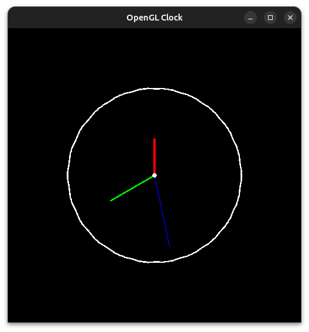

# Digital Clock

## Building
To build & run this example, run the following command within this directory
```sh
make && ./clock
```

Otherwise use `g++` as follows
```sh
g++ clock.cpp -o clock -lGL -lGLU -lglut && ./clock
```

## Preview


